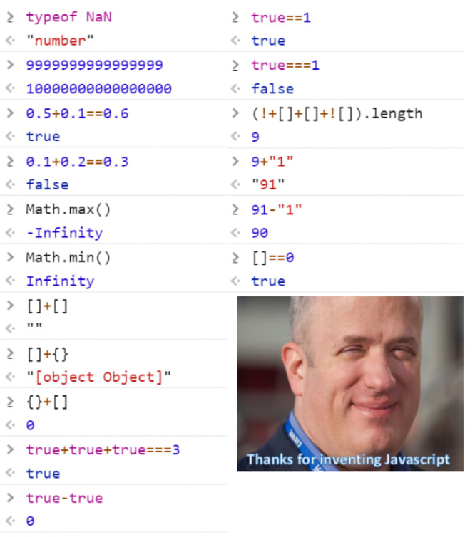

# Javascript open-source web converters

[How to download and use the converters](#how_to)

Any contribution, fork, improvement, suggestion is welcome! Let's create a pack of simple converters!

Online converters are great, yet sometime they lack ergonomy and when you don't have an internet connection, you're screwed.. also they're webpages with a backend so you can't reliably back-them-up so when the site closes, well that's work that has been done in vain...

And don't even get me started on the redundancy, I'm pretty sure there are 100000 variants of the simple feets to meters converter...

Also they often rely on PHP, which is a great language, but again you're dependend on having a webserver... js can do simple waths, well it sorta can:

#how_to

To download the whole pack click on **Clone or download > Download ZIP**

You may also download individual HTML files and open them with your javascript capable browser (there are no external scripts or ressources sos No-Script should work fine)

If you downloaded the whole pack, unzip it then double click the individual html files or right click > open with firefox/chrome/...

The .html are self contained, you may mail them to a friend indeed or whatever ;)

Enjoy!
